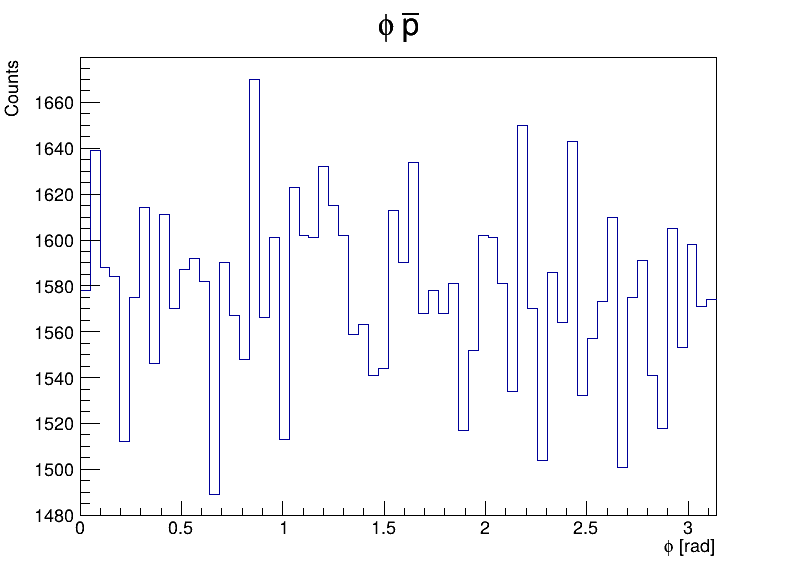

# CERN particles analysis with Pythia & ROOT

Simulation and analysis of proton–proton collisions at √s = 13.6 TeV using Pythia 8 and ROOT.  The project implements a complete analysis pipeline including event generation, final-state particle analysis, histogram production, and visualization.

### Project goal

The goal of this project is to generate approximately 100,000 pp collision events at 
√s = 13.6 TeV and analyze distributions of final-state particles using C++ and ROOT, following standard high-energy physics analysis workflows.

### Implemented functionality

**Event generation**

Proton–proton collisions are generated at a center-of-mass energy of √s = 13.6 TeV using Pythia 8. A fixed random seed is used to ensure reproducibility.  
Only final-state particles are considered in the analysis using the isFinal() flag.

**Analysis**

For each generated event, the following observables are computed:

- particle multiplicity per event

- transverse momentum pT

- pseudorapidity η

- azimuthal angle φ

The analysis is performed separately for:

- all particles

- all charged particles

- π⁺ and π⁻

- K⁺ and K⁻

- p and p̄

### Project structure

```bash
.
├── CMakeLists.txt
├── macros
│ └── draw_plots.C
└── src
  ├── analysis.cpp
  ├── analysis.h
  ├── generator.cpp
  ├── generator.h
  └── main.cpp
```

During execution, the program automatically creates the following output structure:

```bash
└── output
  ├── analysis.root
  └── plots
    ├── png
    │  └── *.png
    └── pdf
       └── *.pdf
```

## Requirements

The project requires:

- a C++17 compatible compiler

- ROOT 6

- Pythia 8

- CMake version 3.10 or newer

### How to run the project

**1. Build the program**

```bash
mkdir build
cd build
cmake ..
make
```

**Note!**  The path to the local Pythia 8 installation must be set manually in `CMakeLists.txt` by editing  
`set(PYTHIA_DIR <insert your Pythia's path here>)` before running CMake.

**2. Run the analysis**

```bash
./particles_analysis
```

This generates events, performs the analysis, and creates `output/analysis.root`.

**3. Generate plots**

```bash
cd ..
root -l -q macros/draw_plots.C
```

This saves plots as PNG and PDF in `output/plots/`.

**4. Inspect the ROOT** (optional)

```bash
root output/analysis.root
```

Inside root:

```bash
_file0->ls();
TBrowser b;
```

After these steps, analysis and visualization pipeline is complete. 

### Example



Azimuthal angle φ distribution for antiprotons (p̄), showing an approximately uniform azimuthal symmetry.

### Author

Prepared by Tomasz Pawlaczyk as part of a CERN internship recruitment task.
